# Adopte ton festival !

_L'important, c'est la formation de la pensée, pas l'exercice formel en tant que tel (Pierre Cassou-Noguès)._

- [Adopte ton festival !](#adopte-ton-festival-)
  - [Résumé](#résumé)
  - [Cas d'utilisation](#cas-dutilisation)
  - [Demo](#demo)
  - [Méthodologie de travail](#méthodologie-de-travail)
  - [Phase 0. Préparation](#phase-0-préparation)
    - [Rôles](#rôles)
    - [Environnement](#environnement)
  - [Phase 1. Cahier des charges](#phase-1-cahier-des-charges)
    - [Méthode QQCOQP](#méthode-qqcoqp)
    - [Backlog de l'application](#backlog-de-lapplication)
  - [Phase 2. Conception](#phase-2-conception)
  - [Phase 3. Développement](#phase-3-développement)
    - [Base de données](#base-de-données)
    - [Backend](#backend)
    - [Frontend](#frontend)
  - [Conclusion](#conclusion)

---

## Résumé

- Besoin : Proposer une solution pour consulter des données publiques avec la possibilité de mise à jour par l'utilisateur. 

- Projet : Création d'un site aggrégant les festivals actifs en France, permettant une recherche facile avec la possibilité de signaler des erreurs.

## Cas d'utilisation

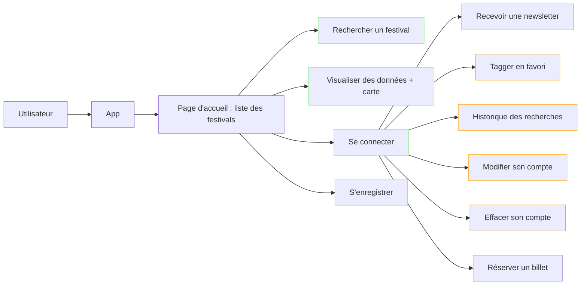

## Demo

## Méthodologie de travail

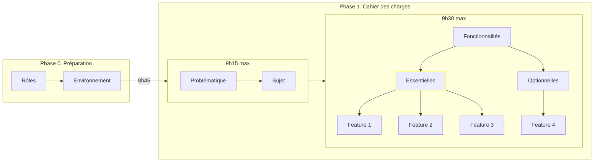

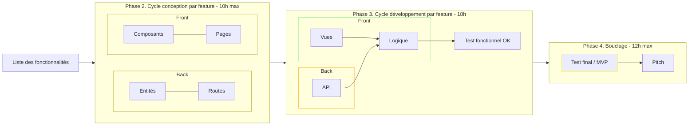
---

## Phase 0. Préparation

### Rôles

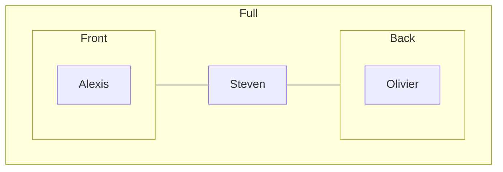

### Environnement

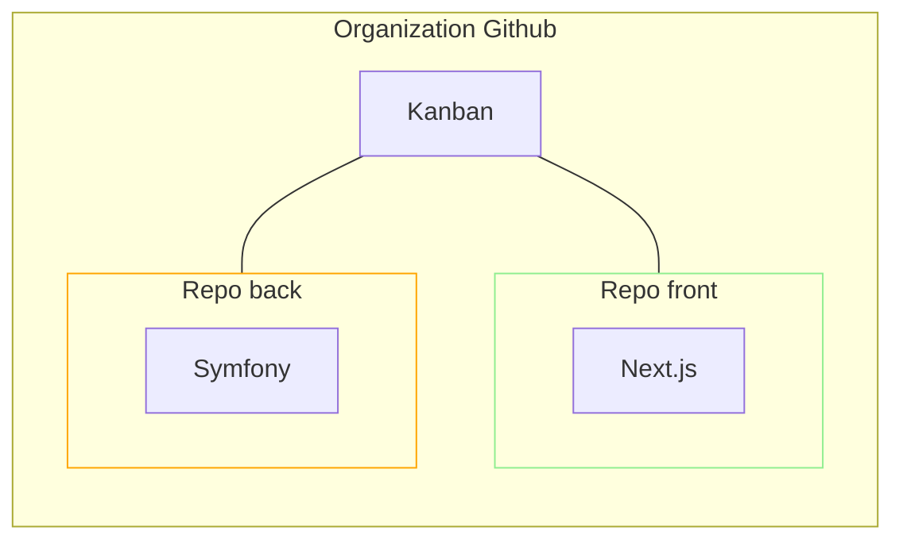

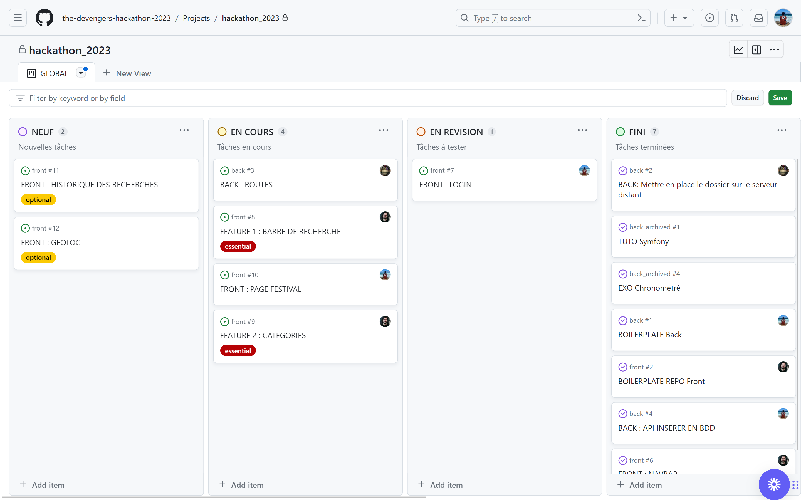

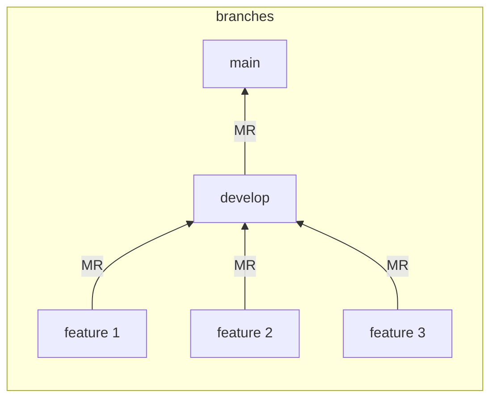

## Phase 1. Cahier des charges

### Méthode QQCOQP

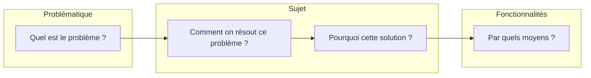

### Backlog de l'application

| Type | Description | Route |
| -------- | -------- | -------- |
| Essentielle - OK | Affichage des cartes page Home | api/festivals GET |
| Essentielle - OK | Barre de recherche | api/search GET |
| Essentielle | Recherche par catégories (select) | api/categories/{id} GET | 
| Essentielle - OK | Page festival | api/festivals/{id} GET |
| Essentielle - OK | Log in | api/login_check POST |
| Essentielle - OK | Register | api/users POST |
| Essentielle | Signaler une arreur | api/festivals/{id} PUT |
| Optionnelle | Affichage de l'historique des recherches |  |
| Optionnelle | Affichage de cartes selon géolocalisation IP |  |

## Phase 2. Conception

<!-- ```mermaid
graph LR

subgraph Front
direction LR

subgraph Composants
A
B
C
end

subgraph Pages
1
2
3
end

end

subgraph Back
direction LR

subgraph Entités
D
E
F
end

subgraph Routes
4
5
6
end

end

Front --- Back

``` -->

- Maquettage sur papier

- Routes sur papier

## Phase 3. Développement

### Base de données

- API Festivals en France
- BDD relationnelle mySQL
- Insertion table via CSV

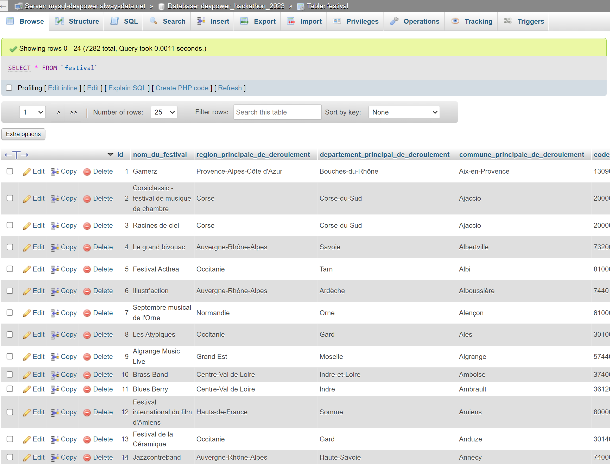

### Backend

- API REST avec route JWT

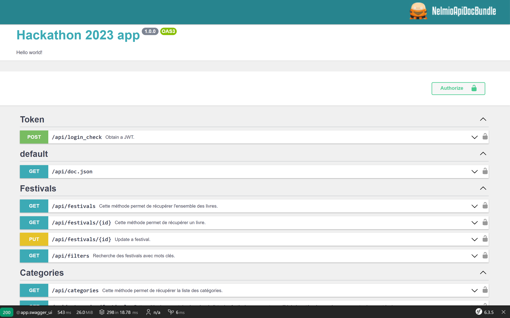

### Frontend

- Consommation API et visualisation des données
- Interface responsive
- Ajout d'un user (axe d'amélioration : password hashing)
- Authentification

<!--


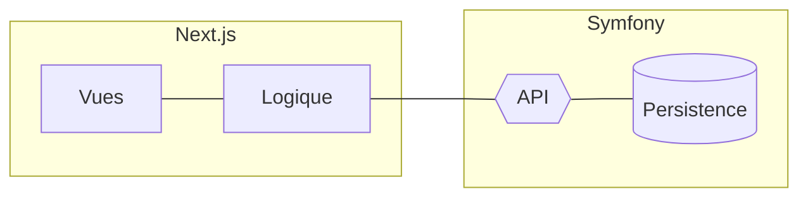

Vues : montrer file structure

Logique : montrer exemple fetch

API : montrer les routes via Nelmio

Persistence : montrer les accès à la base

### Sécurisation

Front : sécurisation des formulaires avec DOM purify ?

Back : utilisation de `htmlspecialchars` + JWT pour protéger les routes

## MVP -->

## Conclusion

- Stack : 

  - Front : Next.js

  - Back : Symfony

- Résultats :

| Phase | Description | Compétence
| -------- | -------- | -------- |
| Préparation | Répartition des rôles et choix des technos (focus prêt à l'emploi) | Concertation |
| Préparation | Mise en place de l'environnement de travail | Organisation |
| Conception | Choix des composants/entités | Travail d'équipe |
| Réalisation | Push GitHub + tests fonctionnels | Travail d'équipe |
| Réalisation | Features essentielles / optionnelles | Sens des priorités |
| Pitch | Bouclage | Esprit de synthèse |

- Difficultés :

| Phase | Description | Compétence
| -------- | -------- | -------- |
| Préparation | Mise en place de Docker avec MySql et non postgresql | Config |
| Préparation | postgresql | Autoformation |
| Réalisation | Plan | Cycle de développement par feature exigeant dans les délais --> tendance à avancer sur toutes les features pour respecter les délais |
| Réalisation | Mentors | Profiter davantage de leurs avis |
<!-- | Réalisation | Next.js | Moins bien adapté pour une petite appli |
| Réalisation | Symfony | Prioriser API Platform pour respecter les délais | -->