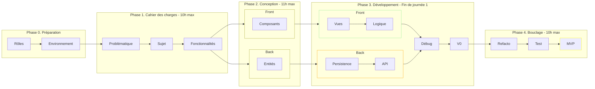
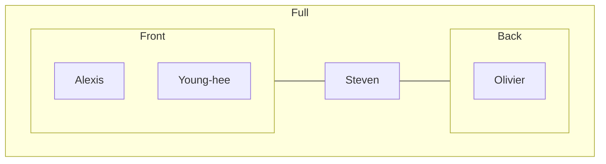
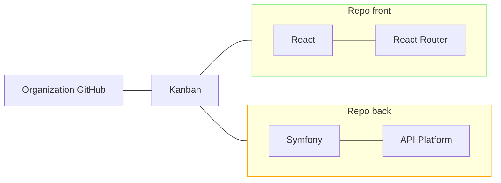
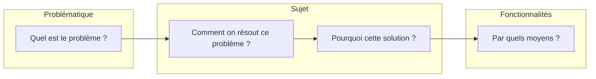

# Titre de l'app

_L'important, c'est la formation de la pensée, pas l'exercice formel en tant que tel (Pierre Cassou-Noguès)._

- [Titre de l'app](#titre-de-lapp)
  - [Plan](#plan)
  - [Phase 0. Préparation](#phase-0-préparation)
    - [Rôles](#rôles)
    - [Environnement](#environnement)
  - [Phase 1. Cahier des charges](#phase-1-cahier-des-charges)
    - [Méthode QQCOQP](#méthode-qqcoqp)
  - [Phase 2. Conception](#phase-2-conception)
    - [Front : Composants](#front--composants)
    - [Back : Entités](#back--entités)
  - [Phase 3. Développement](#phase-3-développement)
    - [Front : Vues](#front--vues)
    - [Back : Persistence](#back--persistence)
    - [Back : API](#back--api)
    - [Front : Logique](#front--logique)
  - [MVP](#mvp)
  - [Conclusion](#conclusion)

---

## Plan

---

## Phase 0. Préparation

### Rôles

### Environnement

## Phase 1. Cahier des charges

### Méthode QQCOQP

## Phase 2. Conception

### Front : Composants

### Back : Entités

## Phase 3. Développement

### Front : Vues

### Back : Persistence

### Back : API

### Front : Logique

## MVP

## Conclusion

- Projet : 

- Front : React - React Router

- Back : Symfony - API Platform

- Résultats :

| Phase | Description | Compétence
| -------- | -------- | -------- |
| Préparation | Répartition des rôles et choix des technos (focus prêt à l'emploi) | Concertation |
| Préparation | Mise en place de l'environnement de travail | Organisation |
| Conception | Choix des composants/entités | Travail d'équipe |
| Réalisation | Push GitHub + tests fonctionnels | Travail d'équipe |
| Réalisation | Respect des délais | Sens des priorités |
| Pitch | Bouclage | Esprit de synthèse |

- Difficultés :