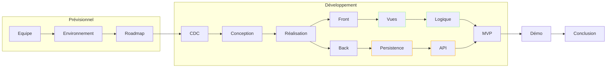
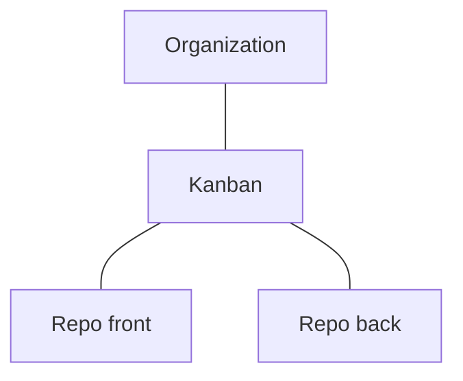
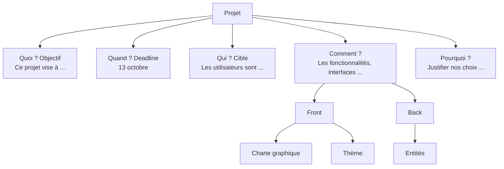
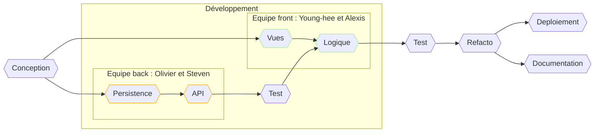

_L'important, c'est la formation de la pensée, pas l'exercice formel en tant que tel (Pierre Cassou-Noguès)._

## Plan

## Résumé

- Projet : dans le cadre du Hackathon 2023, développement intensif en équipe de quatre développeurs d'une application web X.

- Front : Next.js

- Back : Symfony - API Platform

- Résultat :

  - Organisation de l'environnement de travail

  - Conception et réalisation de l'application

  - Collaboration en équipe

  - Mise en pratique des connaissances sur un délai de développement très court

### Objectifs

Conformément au cahier des charges (CDC) :

- Lister les attendus du projet

- Lister les contraintes du projet

- Concevoir le projet

- Réaliser si possible une première version du projet

- Présenter les résultats

## Prévisionnel

### Equipe

- Frontend : Young-hee et Alexis

- Backend : Olivier

- Fullstack : Steven

### Environnement de développement

Etant donné le délai très court du projet, nous avons estimé pertinent d'anticiper la mise en place du cadre organisationnel et technique.

- GitHub : mise en place d'une équipe, un tableau Kanban et deux dépôts

- Choix des technologies : nous avons opté pour des technologies offrant des composants prêts à l'emploi, afin de gagner du temps et de nous concentrer sur la satisfaction du besoin (business logic) :

  - Front : React, avec Material UI (MUI), Next.js ?

  - Back : PHP Symfony + API Platform

### Roadmap

Nous avons également anticipé les grandes étapes du projet :

- Une fois la consigne connue, brainstorming et définition du CDC (méthode QQCOQP).
- 

- Puis, une phase de conception et de réalisation, découpée en quatre grandes couches de responsabilité.

## Cahier des charges

## Conception et architecture

## Réalisation

## Demo

## Conclusion
